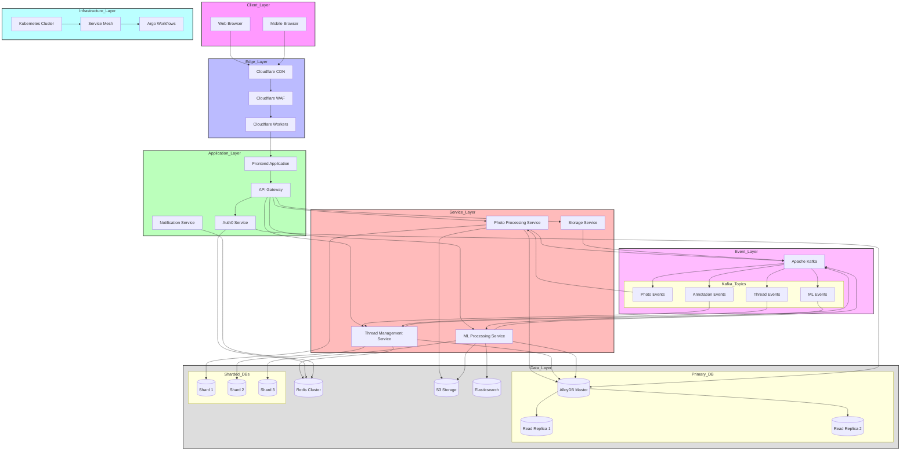
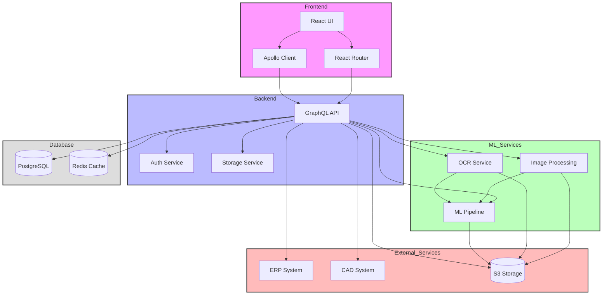
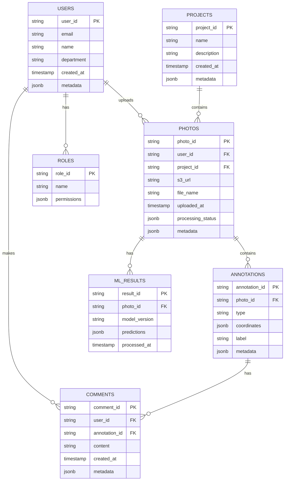

# 📷 ProductCenter - Visual Communication Platform for Manufacturing

A modern, scalable platform for visual communication in manufacturing environments using OCR and image processing technologies.

## 📋 Table of Contents
- [Overview](#overview)
- [Target Customers](#target-customers)
- [Core Features](#core-features)
- [Technical Architecture](#technical-architecture)
- [Development Setup](#development-setup)
- [Deployment](#deployment)
- [Monitoring & Observability](#monitoring--observability)
- [Security](#security)
- [Performance](#performance)
- [Contributing](#contributing)
- [License](#license)

## 🧩 Overview

A web-based platform to help large manufacturing companies (500+ employees) communicate using annotated photographs. The solution enables factory workers, engineers, and procurement teams to collaborate seamlessly on quality issues, design clarifications, and production feedback.

### Main Use Case

A factory worker notices a defect (e.g., a scratch on a part). They take a photo, circle the defect, write a comment (e.g., "Is this OK?"), and engineers or procurement staff can respond directly in a threaded conversation tied to the photo annotation.

## 🎯 Target Customers

- Large manufacturing companies
- Industry sectors: automotive, aerospace, electronics, heavy machinery

## ✅ Core Features

### User Roles

- **Factory Worker** – Upload and annotate photos
- **Engineer** – Review, comment, approve/reject
- **Procurement** – Monitor and participate
- **Admin** – User management and permissions

### Core Functionality

| Feature               | Description                                                  |
| --------------------- | ------------------------------------------------------------ |
| 📸 Photo Upload       | Upload PNG/JPEG files via web or mobile                      |
| 🧭 Annotation Tools   | Draw circles, arrows, and add text labels on images          |
| 🗨️ Comment Threads   | Start/reply to threaded messages linked to image annotations |
| 👥 Multi-user Threads | Collaborative discussions across departments                 |
| 📁 File Organization  | Organize photos by project, part number, or team             |
| 🔔 Notifications      | Real-time alerts via browser/email                           |
| 🕓 Audit Trail        | History of uploads, annotations, and responses               |
| 🔐 Access Control     | Role-based access and visibility                             |

### Advanced Features

- **Image Processing & OCR**
  - High-accuracy OCR for manufacturing documents
  - Real-time image annotation and markup
  - Multi-language support
  - Batch processing capabilities

- **Collaboration Tools**
  - Real-time annotations and comments
  - Thread-based discussions
  - Role-based access control
  - Project-based organization

- **AI/ML Capabilities**
  - Automated document classification
  - Text extraction and analysis
  - Pattern recognition
  - Quality assurance checks

## 🏗 Technical Architecture

### Infrastructure Deployment Diagram



### Infrastructure Components

#### Client Layer
- **Web Browser**: Desktop web interface
- **Mobile Browser**: Mobile web interface

#### Edge Layer
- **Cloudflare CDN**: Content delivery network
- **Cloudflare WAF**: Web application firewall
- **Cloudflare Workers**: Edge computing platform

#### Application Layer
- **Frontend Application**: React-based web application
- **API Gateway**: GraphQL API gateway
- **Auth0 Service**: Authentication and authorization
- **Notification Service**: Real-time notifications

#### Service Layer
- **Photo Processing Service**: Image handling and processing
- **Thread Management Service**: Discussion thread management
- **Storage Service**: File storage management
- **ML Processing Service**: Machine learning pipeline

#### Event Layer
- **Apache Kafka**: Event streaming platform
- **Kafka Topics**:
  - Photo Events
  - Annotation Events
  - Thread Events
  - ML Events

#### Data Layer
- **Primary Database**:
  - AlloyDB Master
  - Read Replicas
- **Sharded Databases**:
  - Shard 1 (Photo data)
  - Shard 2 (Thread data)
  - Shard 3 (ML data)
- **Redis Cluster**: Caching layer
- **S3 Storage**: Object storage
- **Elasticsearch**: Search engine

#### Infrastructure Layer
- **Kubernetes Cluster**: Container orchestration
- **Service Mesh**: Service-to-service communication
- **Argo Workflows**: Workflow automation

### System Block Diagram



### Component Descriptions

#### Frontend
- **React UI**: Main user interface built with React and TypeScript
- **Apollo Client**: GraphQL client for data fetching and state management
- **React Router**: Client-side routing

#### Backend
- **GraphQL API**: Main API layer using Apollo Server
- **Auth Service**: Authentication and authorization
- **Storage Service**: File storage management

#### ML Services
- **OCR Service**: Text extraction from images
- **Image Processing**: Image annotation and preprocessing
- **ML Pipeline**: Orchestration of ML tasks

#### External Services
- **ERP System**: Enterprise Resource Planning integration
- **CAD System**: Computer-Aided Design integration
- **S3 Storage**: Cloud storage for files and images

#### Database
- **PostgreSQL**: Primary database for structured data
- **Redis Cache**: Caching layer for performance optimization

### Data Flow

1. **User Interaction**
   - Users interact with the React UI
   - Requests are routed through React Router
   - Data is fetched via Apollo Client

2. **API Processing**
   - GraphQL API receives requests
   - Auth Service validates requests
   - Storage Service manages file operations

3. **ML Processing**
   - OCR Service extracts text from images
   - Image Processing handles annotations
   - ML Pipeline coordinates ML tasks

4. **External Integration**
   - ERP System provides part data
   - CAD System provides design data
   - S3 Storage handles file persistence

5. **Data Persistence**
   - PostgreSQL stores structured data
   - Redis caches frequently accessed data

### Tech Stack

#### Frontend
- React with TypeScript
- GraphQL (Apollo Client)
- Tailwind CSS
- Storybook for component development

#### Backend
- GraphQL (Apollo Server)
- Rust (axum) for high-performance services
- TypeScript/Node.js for API services
- gRPC for internal service communication

#### Infrastructure
- Google Cloud Platform (GCP)
  - Google Kubernetes Engine (GKE)
  - Anthos Service Mesh
  - Cloud SQL (PostgreSQL/AlloyDB)
  - Cloud Storage
  - Cloud Pub/Sub
- Cloudflare
  - CDN
  - WAF
  - Workers

#### ML/AI
- Python with PyTorch
- OpenCV for image processing
- Vertex AI for model deployment
- Elasticsearch for search

#### DevOps
- GitHub Actions for CI/CD
- ArgoCD for GitOps
- Terraform for IaC
- Datadog for monitoring
- Sentry for error tracking

### Data Models

#### ER Diagram


## 🛠 Development Setup

### Prerequisites
- Node.js 18+
- Rust 1.70+
- Python 3.9+
- Docker
- kubectl
- gcloud CLI

### Local Development

1. **Clone the repository**
```bash
git clone https://github.com/your-org/ocr-platform.git
cd ocr-platform
```

2. **Install dependencies**
```bash
# Frontend
cd frontend
npm install

# Backend
cd ../backend
npm install
cargo build

# ML Services
cd ../ml-services
python -m venv venv
source venv/bin/activate
pip install -r requirements.txt
```

3. **Set up environment variables**
```bash
cp .env.example .env
# Edit .env with your configuration
```

4. **Start development servers**
```bash
# Frontend
npm run dev

# Backend
npm run dev

# ML Services
python run.py
```

### Docker Development

```bash
docker-compose up -d
```

## 🚀 Deployment

### Infrastructure Setup

1. **Initialize GCP resources**
```bash
cd terraform
terraform init
terraform apply
```

2. **Deploy to GKE**
```bash
# Using ArgoCD
argocd app create ocr-platform \
  --repo https://github.com/your-org/ocr-platform.git \
  --path k8s \
  --dest-server https://kubernetes.default.svc \
  --dest-namespace ocr-platform
```

### CI/CD Pipeline

The project uses GitHub Actions for CI/CD with the following workflow:

1. **Build & Test**
   - Lint code
   - Run unit tests
   - Build Docker images
   - Push to container registry

2. **Deploy**
   - Deploy to staging environment
   - Run integration tests
   - Deploy to production

## 📊 Monitoring & Observability

### Application Monitoring
- Datadog for metrics and APM
- Sentry for error tracking
- Custom dashboards for business metrics

### Infrastructure Monitoring
- GCP Cloud Monitoring
- Prometheus + Grafana
- ELK Stack for logs

### Key Metrics
1. **Application Metrics**
   - Response time (p50, p95, p99)
   - Error rates
   - Active users
   - Photo upload success rate
   - Annotation creation time

2. **Business Metrics**
   - Daily active users
   - Photos uploaded per day
   - Average thread length
   - Response time to annotations
   - User engagement by department

3. **Infrastructure Metrics**
   - CPU/Memory utilization
   - Network throughput
   - Storage usage
   - Database performance
   - Cache hit rates

## 🔒 Security

- OAuth 2.0 / OpenID Connect with Auth0
- mTLS for service-to-service communication
- WAF for edge protection
- Regular security audits
- GDPR compliance measures

### Security Requirements

#### Authentication & Authorization
- OAuth 2.0 / OpenID Connect
- Role-based access control (RBAC)
- JWT for API authentication
- MFA support for admin users

#### Data Protection
- End-to-end encryption for file transfers
- Data encryption at rest
- Regular security audits
- GDPR compliance measures

## 📈 Performance

### Response Times
- Page load: < 2 seconds
- Photo upload: < 5 seconds
- Annotation creation: < 1 second
- Thread response: < 500ms

### Scalability Targets
- Support 10,000 concurrent users
- Handle 1000 photo uploads per minute
- Process 5000 annotations per minute
- Support 100,000 daily active users

### Performance Optimizations
- Edge caching with Cloudflare
- Multi-region deployment
- Auto-scaling based on load
- Database optimization with connection pooling
- Redis caching for frequent queries

## 🤝 Contributing

1. Fork the repository
2. Create your feature branch (`git checkout -b feature/amazing-feature`)
3. Commit your changes (`git commit -m 'Add amazing feature'`)
4. Push to the branch (`git push origin feature/amazing-feature`)
5. Open a Pull Request

## 📝 License

This project is licensed under the MIT License - see the [LICENSE](LICENSE) file for details.

## 🙏 Acknowledgments

- [CADDi Engineering](https://speakerdeck.com/caddi_eng/en-company-overview-for-engineers) for architecture inspiration
- Open source community for various tools and libraries

---

*This document is a living artifact and will be updated as requirements evolve.* 